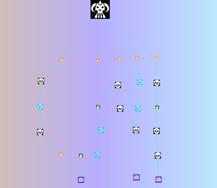
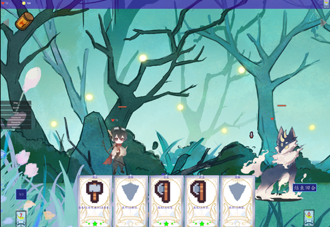
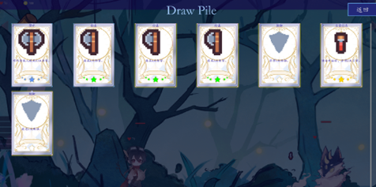
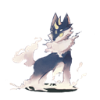
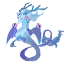
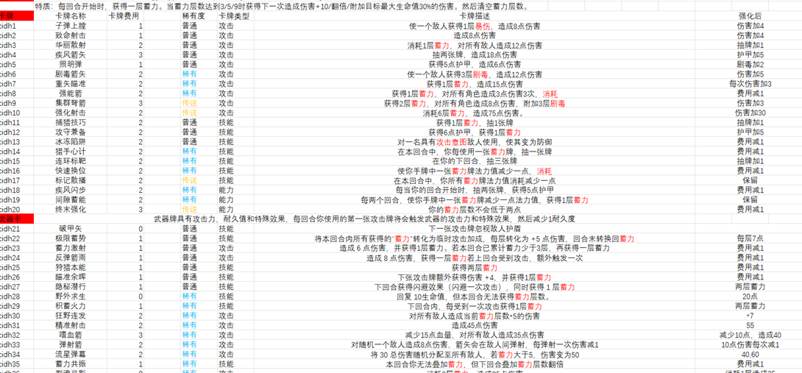

# NightMare Within

## 0. About the Work

**Engine:** Godot  
**Programming Language:** GDScript

We confirm that all art and design in this project were independently completed by team members. AI was only used to assist in some logical aspects; no AI-generated code or images were copied or used. Except for hand-drawn work, some art resources are from free online sources. No non-commercial or infringing materials were used.

---

## 1. Codebase and Commit History

The GitHub repository shows the final lines of code (LOC) close to 15,000. The full commit history is available in the repository.

---

## 2. Game Architecture

### 2.1 Basic Battle Logic diagram 

### 2.2 Card State Machine

- **Base State:** Initial state of the card  
- **Dragging State:** Dragging a card  
- **Aiming State:** Aiming at an enemy target  
- **Released State:** Releasing the card to use it

---

## 3. Game Screenshots (Partial)

- **Roguelike Map Based on RNG**  

- **Combat Showing** 

- **Deck View** 

- **Shop View**

![alt text]NightMare_Within/Intro/image-3.png)

---

## 4. Art Assets (Partial)

---

## 5. Design Showcase (Partial)

---

## 6. Reflections

Maybe we are not good enough, but we enjoyed working on this project.

This time, we adopted an equal and democratic team management approach among three people. After this project, we think that a leader-based decision-making and command-giving approach might be more efficient.

---
